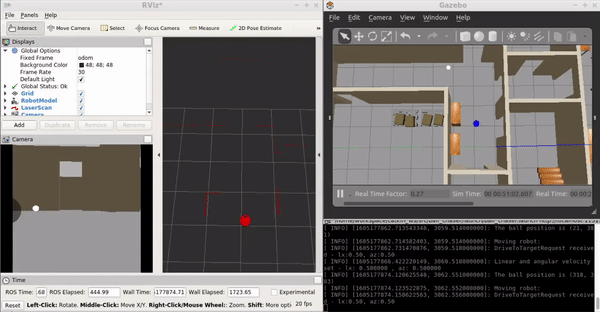

# ball chaser ROS plugin
[](https://www.udacity.com/course/robotics-software-engineer--nd209)

## Outline

Designed a robot inside a gazebo world and implemented a white ball chaser plugin.

<div align="center">
    
</div>

## Install Details

First check for any package updates.  
`$ sudo apt-get update `

Then install the ROS kinetic package.  
`$ sudo apt-get install ros-kinetic-desktop `

Once the package is upto date, change the directory.  
`$ cd ~/workspace/catkin_ws/ `

And run the ROS package world via my_robot.
```
$ catkin_make
$ source devel/setup.bash
$ roslaunch my_robot myworld.world
```

In a new terminal (ctrl + shift + t) then run the ball chase node.
```
$ catkin_make
$ source devel/setup.bash
$ roslaunch ball_chaser ball_chaser.launch
```
Move the white ball in front of the robot and it should start following it.
## Structure Overview

Below the structure of the files is shown.
```
    ├── my_robot                       # my_robot package                   
    │   ├── launch                     # launch folder for launch files   
    │   │   ├── robot_description.launch
    │   │   ├── world.launch
    │   ├── meshes                     # meshes folder for sensors
    │   │   ├── hokuyo.dae
    │   ├── urdf                       # urdf folder for xarco files
    │   │   ├── my_robot.gazebo
    │   │   ├── my_robot.xacro
    │   ├── worlds                     # world folder for world files
    │   │   ├── myworld.world
    │   ├── CMakeLists.txt             # compiler instructions
    │   ├── package.xml                # package info
    ├── ball_chaser                    # ball_chaser package                   
    │   ├── launch                     # launch folder for launch files   
    │   │   ├── ball_chaser.launch
    │   ├── src                        # source folder for C++ scripts
    │   │   ├── drive_bot.cpp
    │   │   ├── process_images.cpp
    │   ├── srv                        # service folder for ROS services
    │   │   ├── DriveToTarget.srv
    │   ├── CMakeLists.txt             # compiler instructions
    │   ├── package.xml                # package info                  
    └──
```
